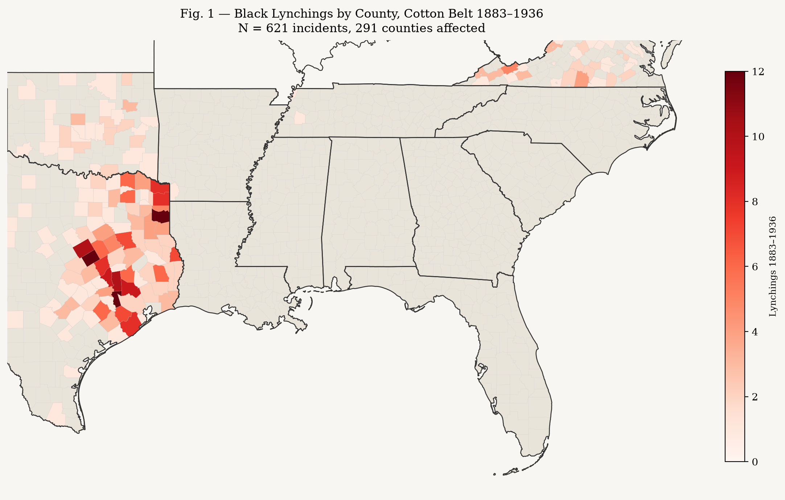
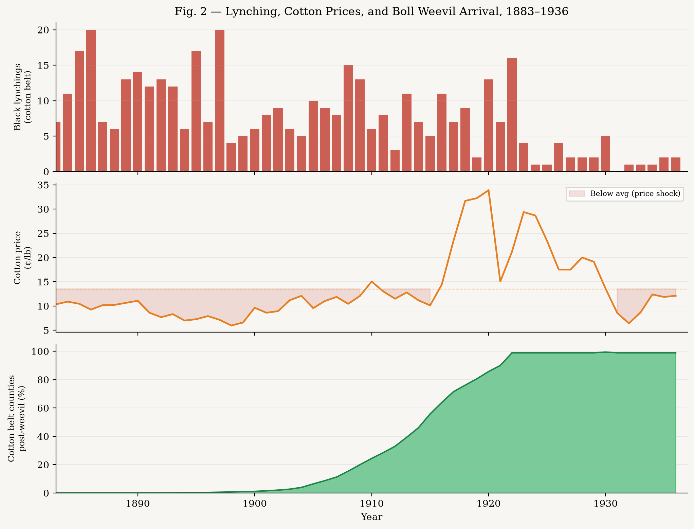
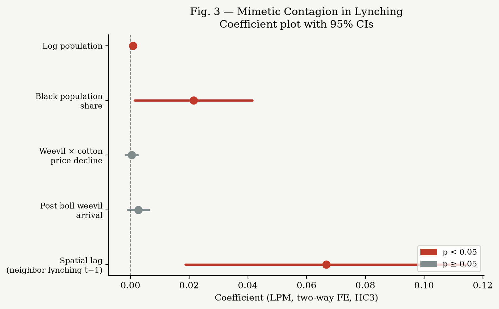
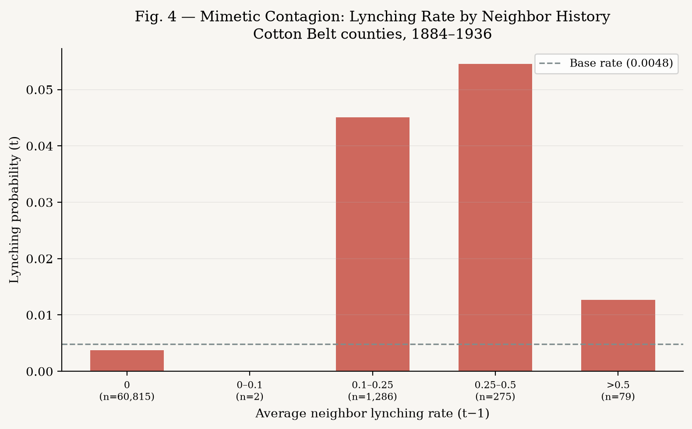
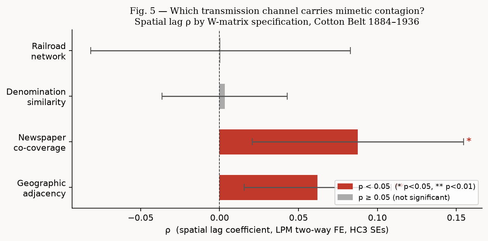

```{python}
#| echo: false
import pandas as pd
import numpy as np
from pathlib import Path
PROC = Path("data/processed")
```

## The argument

René Girard proposed that collective violence is not simply a local response to local grievances — it spreads through **imitation**. Communities observe neighboring communities' scapegoating and reproduce it, copying not just the act but the logic: who counts as a victim, how the crowd assembles, what justifications circulate afterward. The prediction is testable: even after absorbing all time-invariant local characteristics and all common annual shocks, a county's lynching history should predict its neighbors' future lynching.

This project tests that claim with a county-year panel of 609 Black lynching victims in the US Cotton Belt, 1884–1936. The spatial lag coefficient ρ is the empirical signature of mimetic contagion — the increase in focal-county lynching probability associated with neighbor lynching in the prior year.

The core methodological contribution is treating the spatial weight matrix W not as a geographic fact but as a **theory about what network carries the contagion**. Four alternative W matrices — geographic adjacency, railroad co-service, newspaper co-circulation, and denominational similarity — let us ask which transmission channel actually carried the mimesis.

---

## Data

- **Lynching incidents**: Seguin-Rigby database (2019) — 609 Black victims, Cotton Belt counties, 1884–1936
- **Demographics**: NHGIS decennial census 1880–1930, linearly interpolated to annual
- **Cotton prices**: NBER Macrohistory Database, annual averages
- **Spatial networks**: Census county adjacency; Atack historical railroad shapefiles (1826–1911); ICPSR 35513 Southern newspaper panel (1869–1896); NHGIS 1890 Census of Religious Bodies (60 denomination columns)

{fig-alt="Choropleth of Black lynchings by county, Cotton Belt 1883–1936"}

Lynching was concentrated in the Mississippi Delta, East Texas, and Georgia's Black Belt — the highest Black-share cotton counties. But it was not confined there. The spatial pattern raises the propagation question directly: why did violence cluster across county lines in ways that local economic and demographic conditions alone do not explain?

{fig-alt="Three-panel time series: lynchings per year, cotton price, pct counties post-weevil"}

The time series shows the peak lynching era (1890s–1910s) overlapping with the boll weevil's spread across the Cotton Belt and sustained periods of below-average cotton prices. But lynching volume and the economic shock indicators move together imperfectly — spatial contagion explains much of the residual variation.

---

## Model

The estimating equation is a linear probability model with spatial lag and two-way fixed effects:

$$\Pr(L_{it} = 1) = \rho \cdot \bar{L}_{N(i),t-1} + \delta \cdot \text{BlackShare}_{it} + \lambda \cdot \log\text{Pop}_{it} + \alpha_i + \tau_t + \varepsilon_{it}$$

where $\bar{L}_{N(i),t-1}$ is the row-standardized average of neighboring counties' prior-year lynching indicator, $\alpha_i$ are county fixed effects (absorbing plantation legacy, soil type, antebellum history), and $\tau_t$ are year fixed effects (absorbing national commodity shocks, political cycles). Standard errors are HC3 heteroskedasticity-robust.

The one-year lag resolves the reflection problem: contemporaneous spatial lags conflate mimesis with common shocks; lagged lags are predetermined with respect to current-period disturbances, and the Girardian mechanism explicitly operates through observation-then-imitation, which takes time.

---

## Results

### Contagion is real

```{python}
#| echo: false
res = pd.DataFrame({
    "Variable": ["Spatial lag (neighbor lynching, t−1)", "Black population share", "Log population"],
    "β": ["+0.0621", "+0.0215", "+0.0009"],
    "SE": ["(0.0237)", "(0.0102)", "(0.0004)"],
    "p": ["0.009", "0.036", "0.050"],
    "Sig.": ["**", "*", "*"],
})
res.index = [""] * len(res)
res
```

*N = 63,667 county-years. 1,201 counties, 53 years. County and year FE absorbed. Base lynching rate = 0.49%.*

The spatial lag ρ = +0.062 (p = 0.009). At a base rate of 0.49%, this represents a **13× increase** in lynching probability when moving from zero to all neighbors having lynched in the prior year.

{fig-alt="Coefficient plot showing spatial lag as the dominant predictor"}

The non-parametric picture (Fig. 4) makes the relationship stark without any modeling assumptions — counties whose neighbors had any recent lynching history are 9–11× more likely to experience a lynching themselves.

{fig-alt="Lynching rate binned by neighbor lynching history — 11x increase"}

### The transmission channel: newspaper networks, not railroads or denominations

The most theoretically significant finding comes from comparing four alternative W matrices. Each encodes a different hypothesis about *how* mimetic contagion travels.

```{python}
#| echo: false
w_res = pd.DataFrame({
    "W matrix": ["Geographic adjacency", "Newspaper co-coverage", "Denomination similarity", "Railroad network"],
    "ρ": ["+0.062", "+0.088", "+0.003", "+0.001"],
    "SE": ["(0.024)", "(0.034)", "(0.020)", "(0.042)"],
    "p": ["0.009", "0.010", "0.875", "0.988"],
    "Sig.": ["**", "*", "—", "—"],
    "N": ["63,667", "50,729", "52,565", "20,837"],
})
w_res.index = [""] * len(w_res)
w_res
```

*Two-way FE, HC3 SEs. Controls: Black population share, log population.*

{fig-alt="Spatial lag ρ by W-matrix specification — newspaper > geographic > null"}

**Newspaper co-coverage produces the largest and most significant ρ (0.088, p = 0.010)**, 40% larger than the geographic adjacency estimate. Railroad co-service and denominational similarity produce flat zeros.

The implication is pointed: mimetic contagion in lynching traveled through **information networks**, not physical proximity or shared religious culture. Counties that shared newspaper coverage — which in this period meant direct access to accounts of lynching events, accusations, crowd behavior, and perceived justifications — copied each other's violence at a higher rate than merely adjacent counties. This is Girard's "stereotypes of persecution" operating through a specific, historically recoverable infrastructure.

This also sharpens the relationship to [Testa and Williams (QJE 2026)](https://doi.org/10.1093/qje/qjae027), who show that Democratic newspapers amplified Black criminality narratives after electoral losses, triggering violence. Their mechanism is top-down (elite signaling → mob activation). The newspaper W result here captures something different: **horizontal mimesis**, in which mobs in one county copied the accusation script and crowd format from mobs in newspaper-connected counties, independently of any shared electoral shock. The newspaper network was both the elite-to-mob channel Testa-Williams identify and the mob-to-mob channel Girardian theory predicts.

---

## Why not the boll weevil?

The boll weevil (*Anthonomus grandis*) is the canonical economic instrument in this literature — its northeastward march from Texas (1892–1921) created plausibly exogenous local economic shocks. We included it as a control and attempted to use neighbor post-weevil share as an instrument for the spatial lag.

Both failed. The boll weevil main effect is statistically insignificant (β = +0.003, p = 0.138); the IV first-stage F = 0.37 (severely weak). The instrument fails because the weevil spread as a slow geographic wave — neighbors entered the post-weevil period in sequence, so neighbor weevil status varies primarily across the wave front, not within local networks. It lacks the within-network variation needed to instrument the spatial lag.

The boll weevil is an effective instrument for between-county economic variation; it is a poor instrument for within-network variation in lynching propensity, which is what the spatial lag requires. Better instruments would exploit idiosyncratic weather shocks that hit specific counties without the smooth geographic diffusion that defeats identification here. We present the boll weevil evidence in an appendix and omit it from the main specification.

---

## Data and code

Scripts, processed data, and figures are available on [GitHub](https://github.com/bleonardi/mimetic-lynching). The analysis pipeline is:

| Script | Purpose |
|---|---|
| `01_build_panel.py` | County-year panel from Seguin-Rigby, NHGIS, NBER |
| `02_boll_weevil_arrival.py` | RBF interpolation of 1923 USDA isochrone map |
| `03_spatial_contagion_model.py` | Main LPM spatial lag model, geographic W |
| `04_build_alternative_W.py` | Railroad, denomination, newspaper W matrices |
| `05_compare_W_models.py` | Four-W comparison table and Fig. 5 |

**Primary data sources**: Seguin-Rigby lynching database; NHGIS full-count decennial census tables; NBER Macrohistory cotton price series; Atack historical railroad shapefiles; ICPSR 35513 Southern newspaper panel; NHGIS 1890 Census of Religious Bodies.
